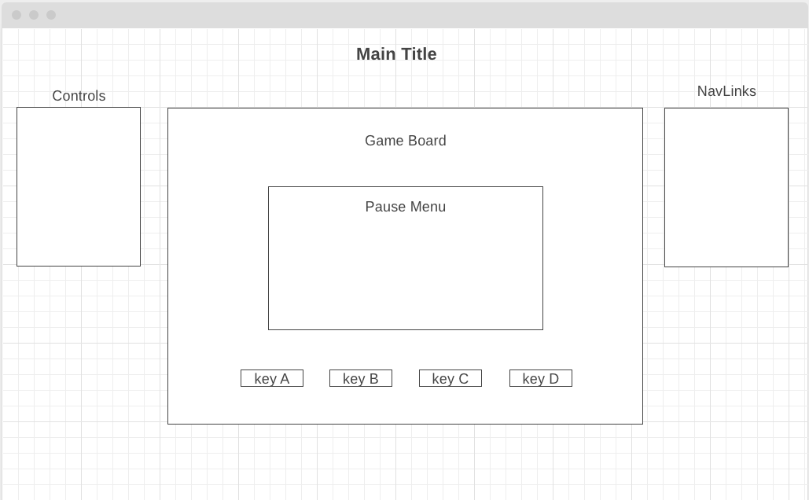

# README

## Background
  Vibe is a music game based on Tap Tap/Guitar Hero that also displays audio visualization. An audio file will produce a set of keys that the player should match. Each time a player correctly matches the key, he earns points. 

## Functionality & MVP
  - Users will be able to:
    - Start, pause and restart the game.
    - Select from a list of songs to play.
    - Earn points from matched keys.
  - In addition, the project will include:
    - A modal describing rules and controls for the game.
    - A production README.

## Wireframes
  

## Architecture and Technologies
  Vibe is built with:
  - `Javascript`
  - `D3.js` + `HTML5` + Audio Api
  - `Webpack` + `Babel` to bundle js files
  In addition to the entry file:
  - `parse.js` handles retrieval and computation of data.
  - `chart.js` handles the logic for rendering visualization of audio file. 

## Implementation Time
  Day 1: Research about visualization on for audio data and other apis or graph libraries that can be used to render the data. Create a config files for the javascript project.
  - create a backbone for the javascript file.
  - try out audio apis.
  Day 2: Build data visualization part of Vibe. Render an audio file's audio visualization as a background for vibe. Setup the javascript code to be able to use separate audio files.
  Day 3: Create a canvas for Vibe. 
  - Setup the board to produce keys that will appear with the music.
  - Create controls that will match keys produced.
  - Setup the code to increment points based on the keys matched.

## Bonus Features
  - allow players to type in a name and record their score.
  - give players a choice on what to render for the audio visualization.
